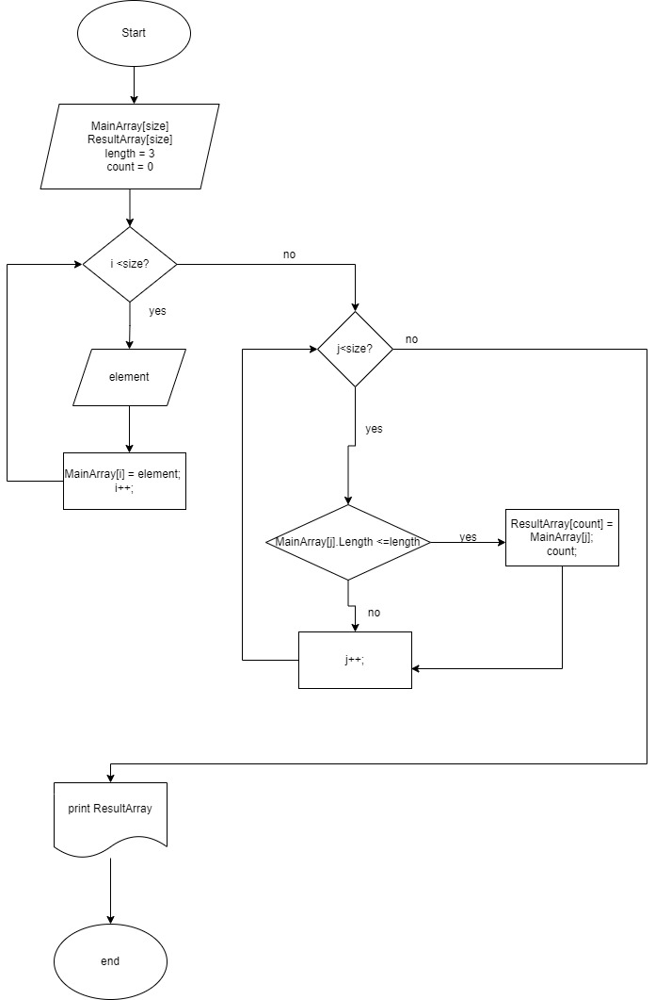

Для выполнения *итогового теста* нам необходимо:

1. Создать репозиторий на GITHUB.

2. Нарисовать блок схему:

 

файл находится в папке Algorithm.

3. Описать наши действия в файле с разрешением **md**
4. Написать программу, решающую поставленную задачу и описать наше решение.

**Задача:**

Написать программу, которая из имеющегося массива строк формирует массив из строк, длина которых меньше либо равна 3 символа. Первоначальный массив можно ввести с клавиатуры, либо задать на старте выполнения алгоритма. При решение не рекомендуется пользоваться коллекциями, лучше обойтись исключительно массивами. 

**_Описание решения итоговой задачи:_**

1. Создадим отдельную папку, назовем ее **TaskResult**.
2. Для решения итоговой задачи нам необходимо ввести два массива.
Первый будет заполняться элементами которые мы хотим ввести, второй будет прогонять это с выводом на экран.
3. Пользователь указывает сколько элементов (N) он хочет задать и заполняет изначальный массив элементами в цикле N-раз.
4. Потом метод, который будет проверять условие ( <=3 ), если да элемент первого массива заносится в count элемент второго массива. 
5. Введем переменная count для того чтобы поочередно  из первого массива добавлять во второй без пробелов. 
6. После присвоения  переменная count увеличивается на 1 и возвращается к циклу for в котором i увеличивается на 1. И так проверяется до конца.

